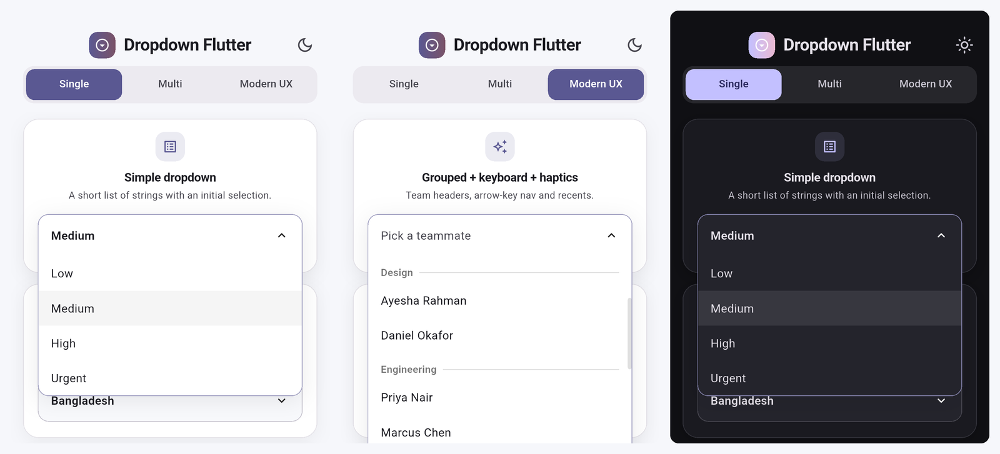
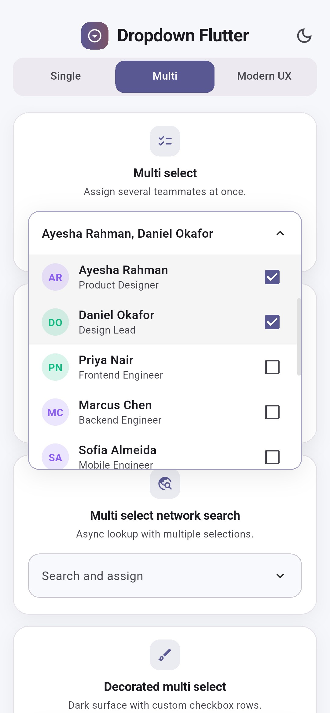
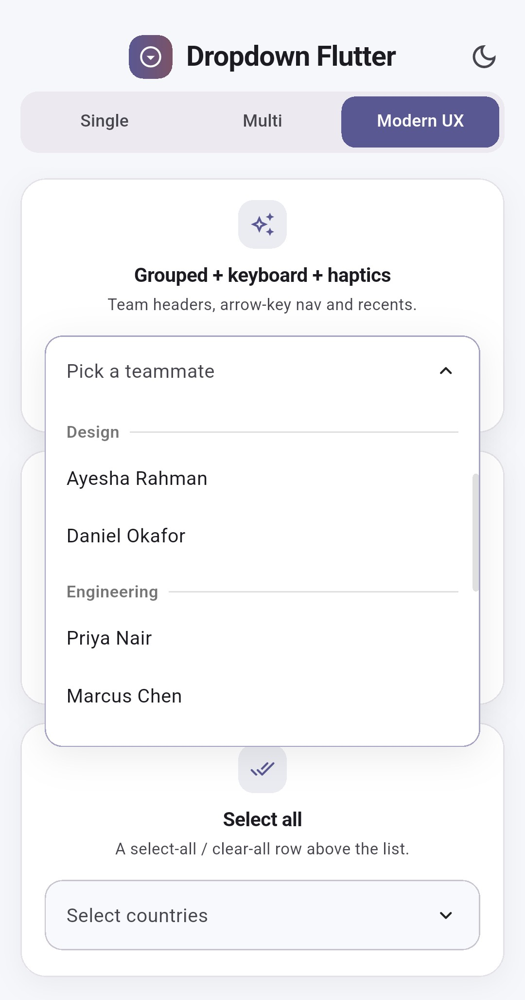
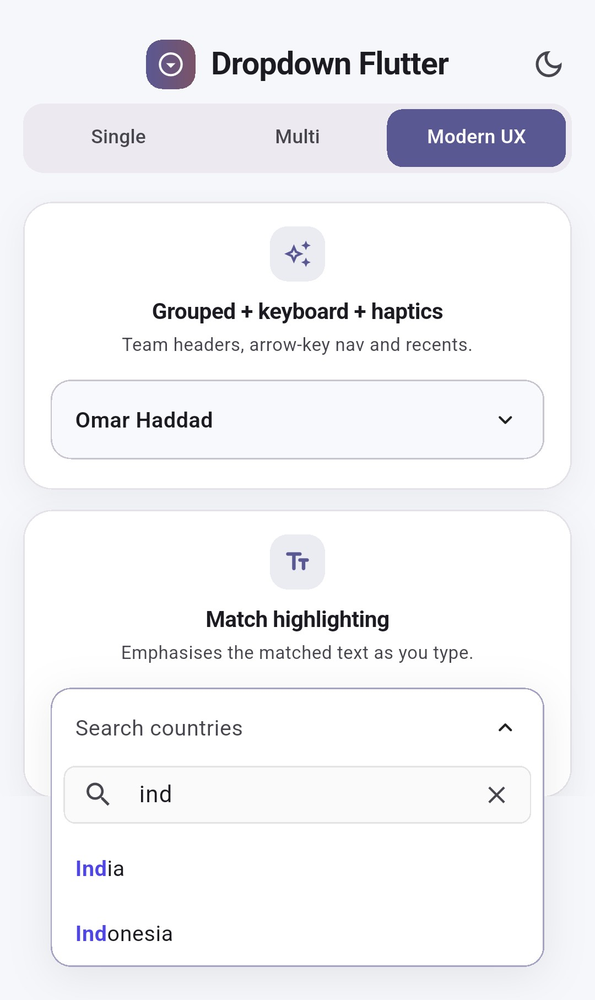
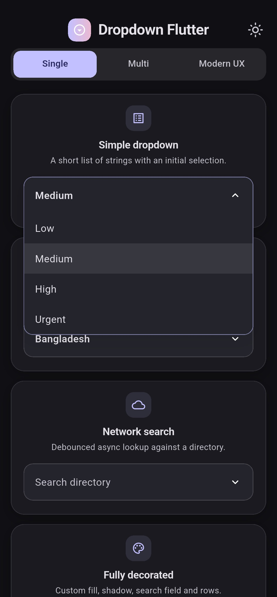

<div align="center">


# Dropdown Flutter

**A customizable Flutter dropdown — search, network search, multi-select and form validation built in.**

[](https://pub.dev/packages/dropdown_flutter)
[](https://pub.dev/packages/dropdown_flutter/score)
[](https://pub.dev/packages/dropdown_flutter/score)
[](LICENSE)



</div>

## Install

```yaml
dependencies:
  dropdown_flutter: ^1.2.1
```

```dart
import 'package:dropdown_flutter/custom_dropdown.dart';

DropdownFlutter<String>(
  hintText: 'Select priority',
  items: const ['Low', 'Medium', 'High', 'Urgent'],
  initialItem: 'Medium',                       // optional
  onChanged: (value) => print(value),
)
```

That is the whole setup — no builders, controllers or config required.

## Constructors

| Constructor | Use it for |
| --- | --- |
| `DropdownFlutter()` | A plain list of items |
| `.search()` | Filtering a local list as the user types |
| `.searchRequest()` | Fetching results from an API |
| `.multiSelect()` | Selecting several items with checkboxes |
| `.multiSelectSearch()` | Multi-select over a filtered local list |
| `.multiSelectSearchRequest()` | Multi-select over API results |

Swap the constructor and keep the rest — every option below applies to all six.
The `multiSelect*` variants report through `onListChanged`; the rest use
`onChanged`.

## Screenshots

<div align="center">

| Multi-select | Grouped | Highlighting | Dark theme |
| :---: | :---: | :---: | :---: |
|  |  |  |  |

</div>

## Usage

### Search — local and network

Plain `String` items search out of the box. For your own type, mix in
`CustomDropdownListFilter` and decide what counts as a match.

```dart
class Member with CustomDropdownListFilter {
  // toString() supplies the row label; filter() decides what matches.
  @override
  String toString() => name;

  @override
  bool filter(String q) => name.toLowerCase().contains(q.toLowerCase()) ||
      role.toLowerCase().contains(q.toLowerCase()); // "engineer" finds them all
}

DropdownFlutter<Member>.search(items: members, onChanged: print);

DropdownFlutter<Member>.searchRequest(          // same, but from an API
  futureRequest: (query) async => api.searchMembers(query),
  futureRequestDelay: const Duration(milliseconds: 300),
  onChanged: print,
);
```


### Validation and controllers

```dart
final controller = SingleSelectController<String?>('Medium');
// MultiSelectController<String>(['Medium']) for multi-select

DropdownFlutter<String>(
  items: priorities,
  controller: controller,                       // read and set from anywhere
  validator: (value) => value == null ? 'Required' : null,
  validateOnChange: true,                       // listValidator for multi-select
  onChanged: print,
);

controller.value = 'High';
controller.clear();
```


### Custom rows

`toString()` gives the default label. For anything richer, supply a
`listItemBuilder` — `headerBuilder`, `hintBuilder` and `noResultFoundBuilder`
work the same way.

```dart
DropdownFlutter<Member>(
  items: members,
  listItemBuilder: (context, item, isSelected, onItemSelect) => Row(
    children: [
      CircleAvatar(child: Text(item.name[0])),
      const SizedBox(width: 12),
      Text(item.name),
    ],
  ),
  onChanged: print,
)
```


## Modern UX

All opt-in and **off by default**, so upgrading changes nothing.

| Property | Effect |
| --- | --- |
| `groupBy` | Splits the list into labelled sections |
| `highlightMatchedText` | Emphasises the matched substring in results |
| `recentSelectionsMaxCount` | Pins recently picked items to the top |
| `showSelectAll` | Adds a select-all / clear-all row (multi-select) |
| `selectAllText` / `clearAllText` | Relabel that row |
| `enableKeyboardNavigation` | Arrow keys move, Enter selects, Escape closes |
| `enableHapticFeedback` | Light impact on open, click on select |
| `animationDuration` / `animationCurve` | Tunes the open/close animation |

```dart
DropdownFlutter<Member>(
  items: members,
  groupBy: (member) => member.team,             // any combination works
  recentSelectionsMaxCount: 3,
  enableKeyboardNavigation: true,
  onChanged: print,
)
```

## Styling

`decoration` covers colors, borders, shadows and text styles; the builders
replace widgets outright. Colors fall back to the ambient `ColorScheme`, so
dropdowns follow a dark theme with no extra configuration.

```dart
DropdownFlutter<String>(
  items: items,
  decoration: CustomDropdownDecoration(
    closedFillColor: const Color(0xFF1E1B33),
    closedBorderRadius: BorderRadius.circular(16),
    headerStyle: const TextStyle(color: Colors.white),
  ),
  onChanged: print,
)

final withIcon = base.copyWith(prefixIcon: const Icon(Icons.person));
```

Size is controlled by `overlayHeight`, `listItemPadding` and `listItemHeight`
— the last defaults to null so rows fit their content; setting it lets the list
scroll more efficiently.

## All properties

| Group | Properties |
| --- | --- |
| **Items** | `items`, `initialItem` / `initialItems`, `excludeSelected`, and the `onChanged` / `onListChanged` callbacks |
| **Text** | `hintText`, `searchHintText`, `noResultFoundText`, `maxlines` (line limit on the closed header) |
| **Sizing** | `listItemHeight`, `overlayHeight`, `listItemPadding` / `itemsListPadding`, `closedHeaderPadding` / `expandedHeaderPadding` |
| **Behaviour** | `enabled`, `canCloseOutsideBounds`, `hideSelectedFieldWhenExpanded`, `closeDropDownOnClearFilterSearch`, `visibility` |
| **Control** | `controller` / `multiSelectController`, `overlayController`, `itemsScrollController` |
| **Async** | `futureRequest` / `futureRequestDelay`, `searchRequestLoadingIndicator` |
| **Recents** | `initialRecentItems`, `onRecentItemsChanged` |
| **Validation** | `validator` / `listValidator`, `validateOnChange` |
| **Appearance** | `decoration` / `disabledDecoration` |
| **Builders** | `listItemBuilder`, `headerBuilder` / `headerListBuilder`, `hintBuilder`, `noResultFoundBuilder`, `groupHeaderBuilder` |

---

<div align="center">

### Made by [Farhan Sadik Galib](https://farhansadikgalib.com)

<a href="https://farhansadikgalib.com">
  
</a>
<a href="https://www.linkedin.com/in/farhansadikgalib/">
  
</a>
<a href="https://github.com/farhansadikgalib">
  
</a>
<a href="https://pub.dev/publishers/farhansadikgalib.com/packages">
  
</a>

If this package saved you time, consider starring the repo ⭐

See the [changelog](CHANGELOG.md) for release notes.
Released under the [MIT License](LICENSE).

</div>
